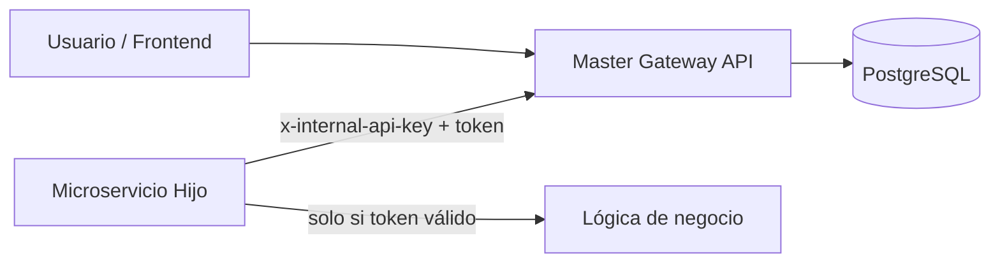
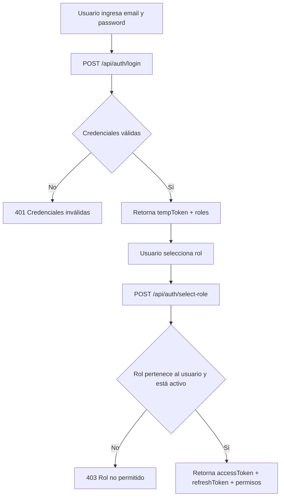
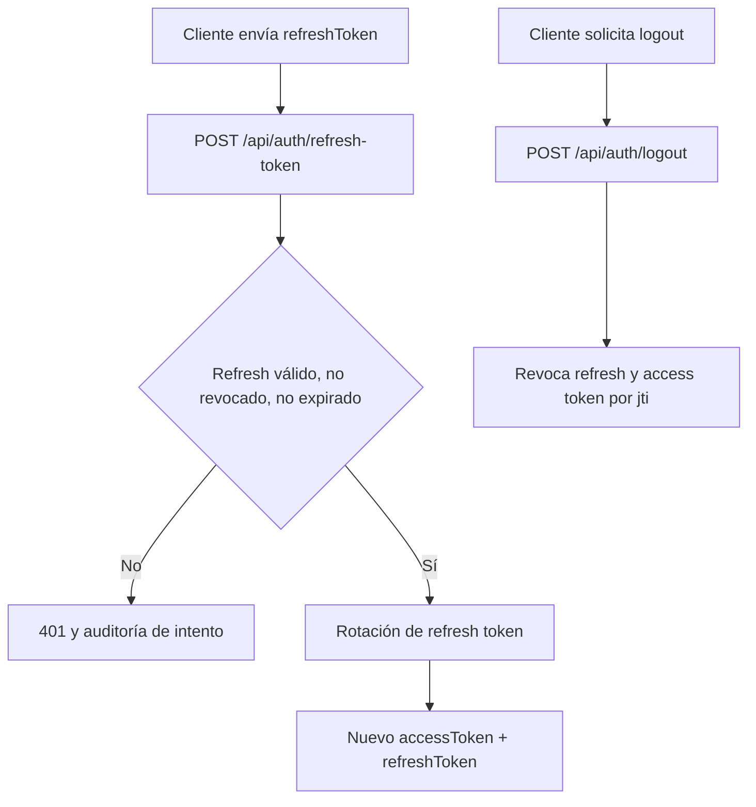
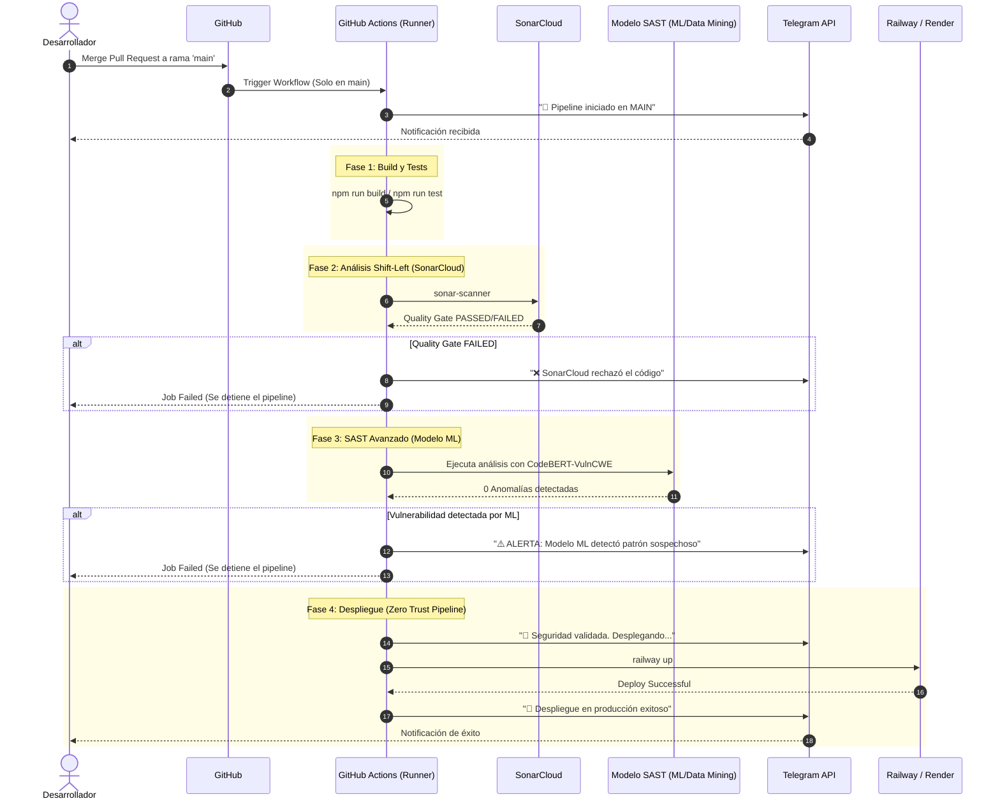

# Master Gateway de Autenticación y Autorización

Sistema académico para centralizar autenticación y autorización por roles en una arquitectura de microservicios, con enfoque de seguridad Zero Trust.

## Objetivo

Este servicio funciona como "puerta maestra" de seguridad para:

- validar credenciales de usuario;
- forzar selección de rol después del login;
- emitir tokens con permisos mínimos por rol activo;
- rotar refresh tokens;
- validar tokens para microservicios internos.

## Estado actual del proyecto (Fase 1)

### Implementado

- `POST /api/auth/login`
- `POST /api/auth/select-role`
- `POST /api/auth/refresh-token`
- `POST /api/auth/logout`
- `POST /api/internals/validate-token`
- Auditoría básica y revocación de tokens
- Script de prueba de humo (`npm run smoke`)

### Pendiente

- CRUD completo de usuarios, roles, módulos y menús
- Menú dinámico recursivo por rol
- Frontend SPA

## Arquitectura de alto nivel



## Flujo principal de autenticación



## Flujo de renovación y cierre de sesión



## Estructura del proyecto

```text
ProyectoP3_SWSeguro/
├── src/
│   ├── app.ts
│   ├── server.ts
│   ├── ai_model/
│   │   ├── index.ts
│   │   └── loader.ts
│   ├── common/
│   │   └── http-error.ts
│   ├── config/
│   │   ├── env.ts
│   │   └── logger.ts
│   ├── lib/
│   │   └── prisma.ts
│   ├── middlewares/
│   │   └── error-handler.ts
│   └── modules/
│       ├── auth/
│       │   ├── auth.routes.ts
│       │   ├── auth.schemas.ts
│       │   └── auth.service.ts
│       └── internals/
│           └── internals.routes.ts
├── prisma/
│   ├── schema.prisma
│   └── seed.ts
├── scripts/
│   ├── smoke-test.mjs
│   └── sast_scan.py
├── test/
│   ├── auth.schemas.test.ts
│   └── auth.service.test.ts
├── .github/
│   └── workflows/
│       ├── validate-source-branch.yml
│       └── ci-cd-pipeline.yml
├── docker-compose.yml
├── .env.example
├── package.json
└── README.md
```

## Requisitos previos

- Node.js 20 o superior
- npm
- Docker Desktop (recomendado) o PostgreSQL 14+ instalado localmente

## Configuración inicial (paso a paso)

1. Clona el repositorio y entra a la carpeta.
1. Crea el archivo de entorno:

```bash
cp .env.example .env
```

1. Abre `.env` y ajusta como mínimo:
   - `DATABASE_URL`
   - `JWT_ACCESS_SECRET`
   - `JWT_TEMP_SECRET`
   - `INTERNAL_API_KEY`

Importante: usa secretos largos, únicos y privados.

## Arranque rápido recomendado (con Docker)

```bash
cp .env.example .env
npm install
npm run db:up
npm run prisma:generate
npm run db:reset
npm run dev
```

Para apagar la base de datos:

```bash
npm run db:down
```

## Arranque manual (sin Docker)

Si ya tienes PostgreSQL local funcionando:

```bash
cp .env.example .env
npm install
npm run prisma:generate
npm run prisma:push
npm run prisma:seed
npm run dev
```

## Endpoints disponibles en esta fase

- `GET /health`
- `POST /api/auth/login`
- `POST /api/auth/select-role`
- `POST /api/auth/refresh-token`
- `POST /api/auth/logout`
- `POST /api/internals/validate-token`

## Pruebas

### Build + unit tests

```bash
npm run build
npm run test
```

### Prueba de humo (flujo completo)

Con el servidor corriendo:

```bash
INTERNAL_API_KEY=change_internal_api_key_min_32_chars npm run smoke
```

El smoke test valida:

- salud del servicio;
- login;
- selección de rol;
- renovación de token;
- validación interna;
- logout;
- rechazo de token revocado.

## Verificación manual con curl

### Salud del servicio

```bash
curl http://localhost:3000/health
```

### Login

```bash
curl -X POST http://localhost:3000/api/auth/login \
  -H "Content-Type: application/json" \
  -d '{"email":"admin@example.com","password":"ChangeMe123!"}'
```

### Selección de rol

```bash
curl -X POST http://localhost:3000/api/auth/select-role \
  -H "Content-Type: application/json" \
  -d '{"tempToken":"<TEMP_TOKEN>","roleId":"<ROLE_ID>"}'
```

### Renovar token

```bash
curl -X POST http://localhost:3000/api/auth/refresh-token \
  -H "Content-Type: application/json" \
  -d '{"refreshToken":"<REFRESH_TOKEN>"}'
```

### Logout

```bash
curl -X POST http://localhost:3000/api/auth/logout \
  -H "Content-Type: application/json" \
  -d '{"accessToken":"<ACCESS_TOKEN>","refreshToken":"<REFRESH_TOKEN>"}'
```

### Validación interna (microservicios)

```bash
curl -X POST http://localhost:3000/api/internals/validate-token \
  -H "Content-Type: application/json" \
  -H "x-internal-api-key: <INTERNAL_API_KEY>" \
  -d '{"token":"<ACCESS_TOKEN>","requiredPermissions":["AUTH_LOGIN"]}'
```

## Variables de entorno más importantes

- `DATABASE_URL`: conexión a PostgreSQL.
- `JWT_ACCESS_SECRET`: firma del access token.
- `JWT_TEMP_SECRET`: firma del token temporal.
- `INTERNAL_API_KEY`: llave para endpoint interno de validación.
- `ACCESS_TOKEN_TTL_SECONDS`, `TEMP_TOKEN_TTL_SECONDS`, `REFRESH_TOKEN_TTL_DAYS`: duración de tokens.

## Guía rápida para personas no técnicas

- Si aparece error de base de datos, normalmente la base no está encendida o la URL está mal.
- Si aparece error de token, suele ser token incompleto, expirado o ya revocado.
- Si aparece `401`, faltan credenciales o no son válidas.
- Si aparece `403`, el usuario sí existe, pero no tiene permisos para esa acción.

## Pipeline CI/CD y Despliegue

El pipeline se activa automáticamente al hacer merge a `main` y ejecuta 4 fases secuenciales con notificaciones vía Telegram.



### Fases del pipeline

| Fase | Descripción |
|---|---|
| **1. Build y Tests** | Compila TypeScript y ejecuta pruebas unitarias |
| **2. SonarCloud** | Análisis estático Shift-Left con Quality Gate |
| **3. Modelo ML** | SAST avanzado con `mahdin70/CodeBERT-VulnCWE` sobre archivos `.py` y `.ts` |
| **4. Despliegue** | Zero Trust deployment en Railway |

Si SonarCloud o el modelo ML detectan anomalías, el pipeline se detiene y se notifica al equipo por Telegram.

### Variables de entorno requeridas para CI/CD

| Variable | Propósito |
|---|---|
| `TELEGRAM_API_URL` | URL de la API de Telegram para enviar mensajes |
| `TELEGRAM_CHAT_ID` | ID del chat/grupo de Telegram |
| `SONAR_TOKEN` | Token de autenticación de SonarCloud |
| `RAILWAY_TOKEN` | Token de Railway para despliegue |
| `RAILWAY_SERVICE` | Nombre del servicio en Railway |
| `APP_URL` | URL pública de la aplicación desplegada |

---

## Política de ramas (protección)

Flujo permitido:

```text
feature/*  →  dev  →  test  →  main
```

Reglas aplicadas por el workflow `.github/workflows/validate-source-branch.yml`:

- `main` solo acepta Pull Requests desde `test`
- `test` solo acepta Pull Requests desde `dev`
- no se permiten Pull Requests desde forks externos

### Cómo dejar el bloqueo efectivo en GitHub

1. Protege las ramas `main` y `test` (Settings → Branches → Branch protection rules).
2. Activa:
   - Require a pull request before merging
   - Require status checks to pass before merging
   - Status check obligatorio: `source-branch-policy`
   - Do not allow bypassing the above settings (si está disponible)
3. Restringe push directo a `main` y `test` (idealmente nadie puede hacer push; solo merge por PR).

Sin el status check obligatorio, el workflow reporta fallo pero GitHub aún podría permitir el merge.

## Seguridad mínima recomendada en desarrollo

- Nunca subas `.env` al repositorio.
- Cambia secretos por valores propios.
- No reutilices tokens de prueba en otros entornos.
- Mantén dependencias actualizadas.
