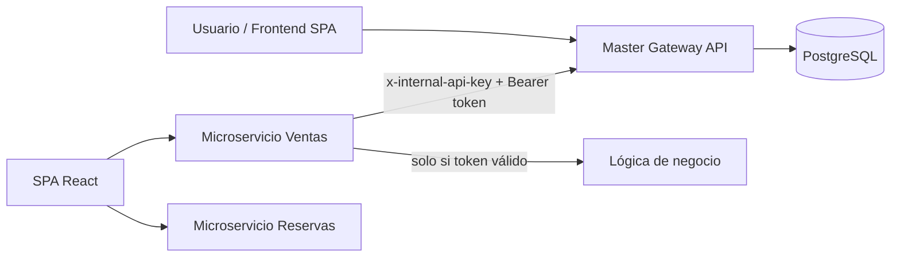
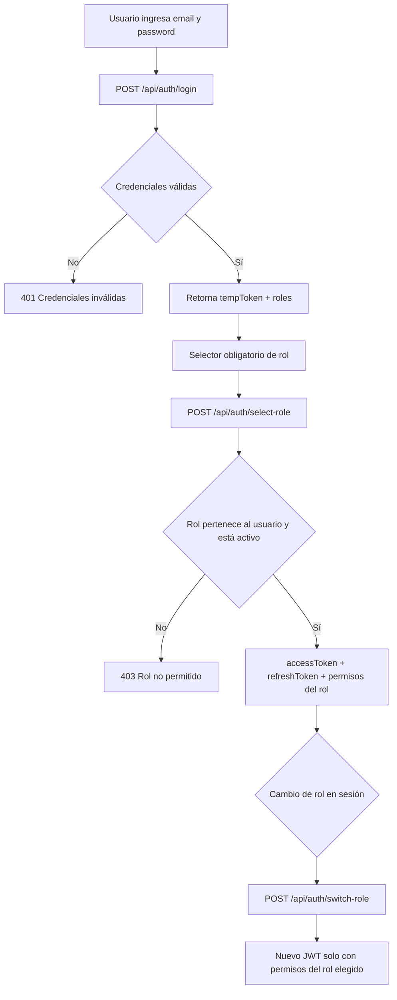
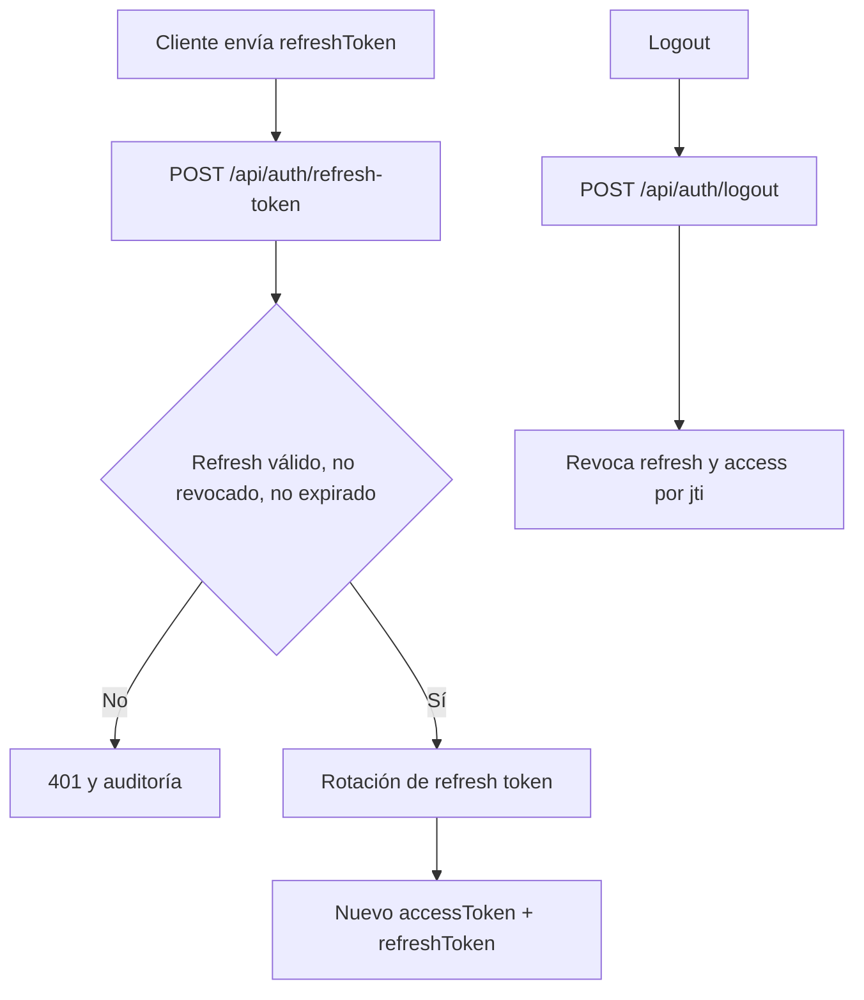
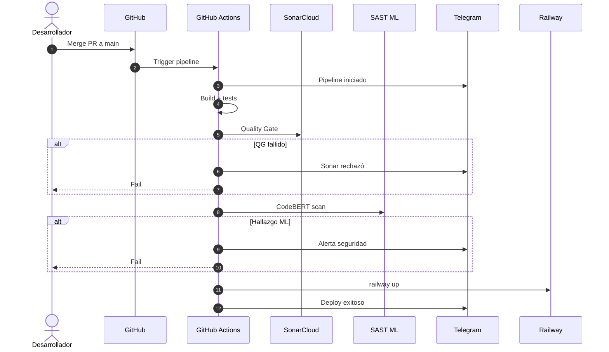

# Master Gateway de Autenticación y Autorización

Sistema académico Full-Stack para centralizar autenticación y autorización por roles en una arquitectura de microservicios, con enfoque **Zero Trust**, **Least Privilege** y **Shift-Left Security**.

## Objetivo

El Master Gateway actúa como puerta maestra de seguridad para:

- validar credenciales de usuario;
- forzar selección de rol después del login;
- emitir JWT limitado al rol seleccionado y sus permisos mínimos;
- rotar refresh tokens y revocar sesiones;
- validar tokens para microservicios hijos (p. ej. Ventas);
- administrar usuarios, roles, módulos, menús y permisos con soft delete y auditoría.

## Estado del proyecto (completo)

| Fase | Alcance | Estado |
| --- | --- | --- |
| **A** | Backend Master (auth, CRUD, menú CTE, seguridad) | Completo |
| **B** | Frontend SPA (login, selector de rol, admin, menú dinámico) | Completo |
| **C** | Microservicio Ventas (Zero Trust) | Completo |
| **D** | DevSecOps (CI/CD, Sonar, SAST/ML, Telegram, Railway) | Completo |
| **E** | Cierre (checklist, smoke E2E, informe) | Completo |

### Destacados recientes

- **Incorporación de módulos** desde la SPA: `baseUrl`, `healthPath`, menús jerárquicos, permisos `{MODULO}_READ` / `_CREATE` y desincorporación
- **Reservas** como módulo hijo demo (`http://localhost:3002`): apartados Resumen / Hoteles / Huéspedes / Reservaciones con navegación por menús del rol
- **Workspace de módulo** (`ModuleWorkspace`): pestañas internas según menús asignados + UI alineada al shell
- **Cambio de rol en sesión**: `POST /api/auth/switch-role` + selector en el lateral (JWT nuevo solo con permisos del rol activo)
- **Menú lateral filtrado** por `RoleMenu` + `RoleModule` + permiso de lectura (no muestra opciones a las que el rol no tiene acceso)
- Administración dinámica de **roles** y **usuarios** (plantillas VENDEDOR/AUDITOR)
- Selector de rol con **Cancelar / otro usuario**
- `GET /api/menus/tree` para cualquier sesión autenticada (navegación por rol; `MENUS_READ` solo para CRUD)
- Seed demo: roles `VENDEDOR` / `AUDITOR` + usuarios de prueba
- Documentación en `docs/` (DevSecOps, checklist, informe LaTeX)

## Arquitectura de alto nivel


```mermaid
flowchart LR
    U[Usuario / Frontend SPA] --> MG[Master Gateway API]
    MG --> DB[(PostgreSQL)]
    SPA[SPA React] --> V[Microservicio Ventas]
    SPA --> R[Microservicio Reservas]
    V -->|x-internal-api-key + Bearer token| MG
    V -->|solo si token válido| BUS[Lógica de negocio]
```

## Flujo principal de autenticación


```mermaid
flowchart TD
    A[Usuario ingresa email y password] --> B[POST /api/auth/login]
    B --> C{Credenciales válidas}
    C -- No --> D[401 Credenciales inválidas]
    C -- Sí --> E[Retorna tempToken + roles]
    E --> F[Selector obligatorio de rol]
    F --> G[POST /api/auth/select-role]
    G --> H{Rol pertenece al usuario y está activo}
    H -- No --> I[403 Rol no permitido]
    H -- Sí --> J[accessToken + refreshToken + permisos del rol]
    J --> K{Cambio de rol en sesión}
    K --> L[POST /api/auth/switch-role]
    L --> M[Nuevo JWT solo con permisos del rol elegido]
```

El JWT definitivo **no** incluye todos los roles del usuario: solo el rol activo y sus permisos. Un usuario puede tener varios roles asignados y cambiar entre ellos sin volver a autenticarse.

## Flujo de renovación y cierre de sesión


```mermaid
flowchart TD
    R1[Cliente envía refreshToken] --> R2[POST /api/auth/refresh-token]
    R2 --> R3{Refresh válido, no revocado, no expirado}
    R3 -- No --> R4[401 y auditoría]
    R3 -- Sí --> R5[Rotación de refresh token]
    R5 --> R6[Nuevo accessToken + refreshToken]
    L1[Logout] --> L2[POST /api/auth/logout]
    L2 --> L3[Revoca refresh y access por jti]
```

## Estructura del proyecto

```text
ProyectoP3_SWSeguro/
├── frontend/                 # SPA React + Vite
├── src/                      # Master Gateway (Express + TS)
├── prisma/                   # Schema, seed, seed demo roles
├── services/ventas/          # Microservicio hijo
├── scripts/                  # smoke + SAST ML
├── test/                     # Pruebas Vitest
├── docs/
│   ├── DEVSECOPS.md
│   ├── COMPLIANCE_CHECKLIST.md
│   ├── informe_proyecto.tex
│   └── informe_proyecto_cuerpo.tex
├── .github/workflows/        # CI/CD y política de ramas
├── sonar-project.properties
├── docker-compose.yml
├── .env.example
├── package.json
└── README.md
```

## Requisitos previos

- Node.js 20+
- npm
- Docker Desktop (recomendado) o PostgreSQL 14+

## Scripts útiles

| Script | Descripción |
| --- | --- |
| `npm run dev` | Master en modo desarrollo |
| `npm run build` / `npm run test` | Build y tests del Master |
| `npm run db:up` / `db:down` / `db:reset` | Postgres Docker + push/seed |
| `npm run seed:demo-roles` | Roles/usuarios demo (VENDEDOR, AUDITOR) |
| `npm run smoke` | Prueba de humo E2E del Master |
| `npm run frontend:dev` / `frontend:build` | SPA |
| `npm run ventas:dev` / `ventas:build` | Microservicio Ventas |

## Configuración inicial

```bash
cp .env.example .env
# Ajusta DATABASE_URL, JWT_*_SECRET, INTERNAL_API_KEY (≥32 chars)
npm install
npm --prefix frontend install
npm --prefix services/ventas install
```

## Arranque rápido (Docker)

```bash
npm run db:up
npm run prisma:generate
npm run db:reset          # incluye seed + roles demo
npm run dev               # Master :3000
npm run ventas:dev        # Ventas :3001  (otro terminal)
npm run frontend:dev      # SPA :5173     (otro terminal)
```

Antes de Ventas:

```bash
cp services/ventas/.env.example services/ventas/.env
# INTERNAL_API_KEY debe coincidir con el Master
```

### Reservas (opcional, proyecto hermano)

El microservicio hotel/reservas vive fuera de este repo (`proyecto-reservas`), típico en:

- API: `http://localhost:3002`
- Postgres demo: puerto host **5434**

En la SPA (como ADMIN):

1. **Módulos** → incorporar **Reservas** (`baseUrl=http://localhost:3002`, `healthPath=/api/stats`)
2. Asignar módulo + menús al rol + permiso `RESERVAS_READ`
3. Botón **Crear apartados Reservas** (Resumen, Hoteles, Huéspedes, Reservaciones)
4. Abrir el módulo desde el menú lateral; la barra de apartados sigue los menús del rol

Variable opcional SPA: `VITE_RESERVAS_URL` (default `http://localhost:3002`).

**Nota:** el Postgres de Docker del Master usa el puerto host **5433** (`localhost:5433`) para no chocar con un Postgres local en `5432`.

Apagar DB:

```bash
npm run db:down
```

## Usuarios y roles demo

| Email | Password | Roles |
| --- | --- | --- |
| `admin@example.com` | `ChangeMe123!` | ADMIN, VENDEDOR, AUDITOR |
| `vendedor@example.com` | `ChangeMe123!` | VENDEDOR |
| `auditor@example.com` | `ChangeMe123!` | AUDITOR |

Regenerar solo demos: `npm run seed:demo-roles`

## Frontend SPA (`http://127.0.0.1:5173`)

1. Login
2. Selección obligatoria de rol (puedes **Cancelar / otro usuario**)
3. Menú dinámico según rol (solo opciones con menú + módulo + permiso de lectura)
4. **Cambiar rol** en el lateral si el usuario tiene 2+ roles (sin re-login)
5. **Roles**: crear, plantillas, asignar usuarios/permisos/módulos/menús  
   - Los menús ofrecidos son solo de módulos ya asignados al rol
6. **Usuarios**: alta rápida con rol inicial
7. **Módulos**: incorporar servicio, salud, menús hijo, permisos del módulo
8. **Ventas** / **Reservas** según permisos del rol activo
9. Logout / pantallas 403, sesión o token expirado

### Asignar varios roles a un usuario

1. Entra como ADMIN → **Roles**
2. Elige p. ej. VENDEDOR → asigna el usuario
3. Repite con AUDITOR (u otro rol)
4. Al login verá el selector; dentro de la sesión puede usar **Cambiar rol**

Más detalle: `frontend/README.md` y `services/ventas/README.md`.

## Endpoints principales

### Auth e interno

- `GET /health`
- `POST /api/auth/login`
- `POST /api/auth/select-role`
- `POST /api/auth/switch-role` (sesión autenticada; rota contexto al nuevo rol)
- `GET /api/auth/my-roles` (roles activos del usuario autenticado)
- `POST /api/auth/refresh-token`
- `POST /api/auth/logout`
- `POST /api/internals/validate-token`

### Administración

- CRUD `/api/users`
- CRUD `/api/roles` + assign `users` / `modules` / `menus` / `permissions`
- `GET /api/roles/{id}` (detalle con asignaciones)
- CRUD `/api/modules` (incluye `baseUrl` / `healthPath`)
- CRUD `/api/menus` + `GET /api/menus/tree` (árbol filtrado por rol/módulo/permiso)
- `GET` / `POST` `/api/permissions`

### Ventas (puerto 3001)

- `GET /api/ventas` → `VENTAS_READ`
- `POST /api/ventas` → `VENTAS_CREATE`

### Reservas (puerto 3002, externo)

- `GET /api/hotels`, `/api/guests`, `/api/reservations`, `/api/stats`
- Visibles en SPA con permiso `RESERVAS_READ` y menús asignados

## Puertos locales

| Servicio | Puerto |
| --- | --- |
| Master Gateway | `3000` |
| Ventas | `3001` |
| Reservas (hermano) | `3002` |
| SPA Vite | `5173` (`127.0.0.1`) |
| Postgres Master (Docker) | `5433` |
| Postgres Reservas (demo) | `5434` |
## Pruebas

```bash
npm run build && npm run test
npm run frontend:build
npm run ventas:build

# Con Master arriba:
INTERNAL_API_KEY=<mismo_del_.env> npm run smoke
```

El smoke valida health → login → select-role → refresh → validate-token → logout → rechazo de token revocado.

## Verificación rápida con curl

```bash
curl http://localhost:3000/health

curl -X POST http://localhost:3000/api/auth/login \
  -H "Content-Type: application/json" \
  -d '{"email":"admin@example.com","password":"ChangeMe123!"}'
```

## Variables de entorno importantes

| Variable | Uso |
| --- | --- |
| `DATABASE_URL` | PostgreSQL (Docker: puerto `5433`) |
| `JWT_ACCESS_SECRET` / `JWT_TEMP_SECRET` | Firma de tokens |
| `INTERNAL_API_KEY` | Validate-token entre Master y Ventas |
| `JWT_ISSUER` / `JWT_AUDIENCE` | Claims JWT |
| `ACCESS_TOKEN_TTL_SECONDS` / `TEMP_TOKEN_TTL_SECONDS` / `REFRESH_TOKEN_TTL_DAYS` | TTLs |

## Pipeline CI/CD y despliegue

Detalle: [`docs/DEVSECOPS.md`](docs/DEVSECOPS.md).

Merge a **`main`** → build/tests → Sonar Quality Gate (**obligatorio**) → SAST/ML → Railway CLI → Telegram.


```mermaid
sequenceDiagram
    autonumber
    actor Dev as Desarrollador
    participant GH as GitHub
    participant GHA as GitHub Actions
    participant SC as SonarCloud
    participant ML as SAST ML
    participant TG as Telegram
    participant RR as Railway

    Dev->>GH: Merge PR a main
    GH->>GHA: Trigger pipeline
    GHA->>TG: Pipeline iniciado
    GHA->>GHA: Build + tests
    GHA->>SC: Quality Gate
    alt QG fallido
        GHA->>TG: Sonar rechazó
        GHA-->>Dev: Fail
    end
    GHA->>ML: CodeBERT scan
    alt Hallazgo ML
        GHA->>TG: Alerta seguridad
        GHA-->>Dev: Fail
    end
    GHA->>RR: railway up
    GHA->>TG: Deploy exitoso
```

### Workflows

| Archivo | Trigger |
| --- | --- |
| `ci-cd-deploy.yml` | Merge a `main` → pipeline + deploy |
| `ci-pr.yml` | PRs a `dev`/`test` → build + tests |
| `notify-merges.yml` | Merges a `dev`/`test`/`main` → Telegram |
| `validate-source-branch.yml` | Solo `test→main` y `dev→test` |

### Secrets de GitHub Actions

`TELEGRAM_BOT_TOKEN`, `TELEGRAM_CHAT_ID`, `SONAR_TOKEN`, `SONAR_PROJECT_KEY`, `SONAR_ORGANIZATION`, `RAILWAY_TOKEN`, `RAILWAY_SERVICE`, `APP_URL`  
(Opcional: `TELEGRAM_API_URL`)

### Dónde desplegar

Recomendado: **Railway** (ya cableado en el pipeline). Alternativa: **Render**.  
Antes de demos en free tier, llama a `GET /health` (cold start). Ventas reintenta `validate-token` con backoff.

## Política de ramas

```text
feature/*  →  dev  →  test  →  main
```

- `main` solo desde `test`
- `test` solo desde `dev`

Activa en GitHub branch protection el status check **`source-branch-policy`**.

## Documentación adicional

| Documento | Contenido |
| --- | --- |
| [`docs/DEVSECOPS.md`](docs/DEVSECOPS.md) | Pipeline, secrets, Railway, cold start |
| [`docs/COMPLIANCE_CHECKLIST.md`](docs/COMPLIANCE_CHECKLIST.md) | Matriz PDF ↔ código |
| [`docs/informe_proyecto.tex`](docs/informe_proyecto.tex) | Informe técnico LaTeX completo |
| [`docs/informe_proyecto_cuerpo.tex`](docs/informe_proyecto_cuerpo.tex) | Cuerpo para `\input` en otro `.tex` |

Compilar informe:

```bash
pdflatex docs/informe_proyecto.tex
# o
pandoc docs/informe_proyecto.tex -o informe.docx
```

## Checklist de defensa

1. `npm run build && npm run test && npm run frontend:build && npm run ventas:build`
2. `npm run db:up && npm run db:reset && npm run smoke`
3. SPA: login → select-role (probar VENDEDOR) → Ventas → **Cambiar rol** a ADMIN → Reservas
4. Incorporar/apartados de módulo desde **Módulos** y verificar que el lateral solo muestra lo permitido
5. Secrets Actions + branch protection + Telegram en un merge a `dev`
6. URL pública en Railway (si aplica) + `/health`

## Seguridad en desarrollo

- Nunca subas `.env` al repositorio.
- Cambia secretos demo antes de cualquier entorno compartido.
- No reutilices tokens de prueba en producción.
- Mantén dependencias actualizadas.
