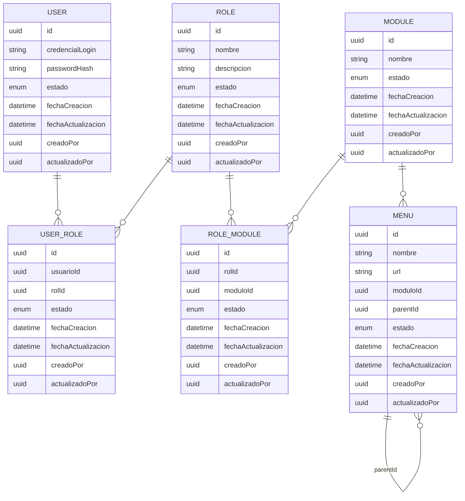

# Modelo conceptual aprobado

`User ↔ UserRole ↔ Role ↔ RoleModule ↔ Module → Menu → Menu (parentId)`

Modelo M:N entre Usuario y Rol, M:N entre Rol y Módulo, 1:N entre Módulo y Menú, y recursivo 1:N dentro de Menú. No existe `RoleMenu`: la visibilidad de un menú depende únicamente de los módulos asignados al rol. `Permission`/`RolePermission` quedan fuera del modelo funcional. `AuditLog` y `RefreshToken` son infraestructura técnica, no entidades funcionales.

---

# Entidades

### User
- **Propósito:** identidad autenticable del sistema.
- **Atributos:** `id`; credencial de login: `email` y `nombre`; `passwordHash`.
- **Auditoría:** completa (`estado`, `fechaCreacion`, `fechaActualizacion`, `creadoPor`, `actualizadoPor`).

### Role
- **Propósito:** unidad de autorización que agrupa módulos y se asigna a usuarios.
- **Atributos:** `id`, `nombre`, `descripcion`.
- **Auditoría:** completa.

### UserRole
- **Propósito:** pivote que materializa la relación M:N Usuario↔Rol.
- **Atributos:** `id`, `userId`, `roleId`.
- **Auditoría:** completa (exigida explícitamente por el documento fuente).

### Module
- **Propósito:** unidad funcional administrativa del sistema (ej. Ventas, RRHH, Financiero).
- **Atributos:** `id`, `nombre`, `descripcion`.
- **Auditoría:** completa.

### RoleModule
- **Propósito:** pivote que materializa la relación M:N Rol↔Módulo.
- **Atributos:** `id`, `roleId`, `moduleId`.
- **Auditoría:** completa.

### Menu
- **Propósito:** nodo de navegación jerárquico (módulo principal, submenú o item), almacenado en una única tabla recursiva.
- **Atributos:** `id`, `nombre`, `url` (nulo salvo en nodos hoja), `moduleId` (FK obligatoria a `Module`), `parentId` (nulo si es raíz; referencia a otro `Menu`).
- **Auditoría:** completa.

---

# Relaciones

| Relación | Cardinalidad | Mecanismo |
|---|---|---|
| User ↔ Role | M:N | Tabla `UserRole` |
| Role ↔ Module | M:N | Tabla `RoleModule` |
| Module → Menu | 1:N | FK `moduleId` en `Menu` |
| Menu → Menu | 1:N recursiva | FK `parentId` en `Menu` |

No existe relación directa Rol↔Menú. La autorización de un nodo de `Menu` se deriva transitivamente: `Role → RoleModule → Module → Menu`.

---

# Diagrama Entidad-Relación

---

# Reglas de negocio

- Un usuario puede tener múltiples roles activos simultáneamente, pero opera bajo un único rol por sesión (seleccionado explícitamente).
- Un rol puede tener acceso a múltiples módulos; un módulo puede estar asignado a múltiples roles.
- Todo `Menu` pertenece obligatoriamente a un único `Module` (`moduloId` no nulo).
- `Menu.url` solo se completa en nodos hoja (sin hijos); en nodos intermedios permanece nulo.
- `Menu.parentId` es nulo únicamente en los nodos raíz (módulo principal del menú); no puede generar referencias cíclicas.
- La visibilidad de un nodo de `Menu` para un rol se determina únicamente a través de la asignación Rol↔Módulo (`RoleModule`); no existe asignación de menú a nivel de rol.
- `User`, `Role`, `Module`, `Menu`, `UserRole` y `RoleModule` no se eliminan físicamente: el borrado es lógico mediante el campo `estado`.

---

# Entidades de infraestructura

### AuditLog
No forma parte del modelo funcional descrito en el documento fuente (que solo exige campos de auditoría dentro de cada entidad). Se mantiene como **infraestructura técnica** porque provee trazabilidad de eventos de seguridad (login, logout, revocación de tokens) requerida por los principios de Zero Trust y Shift-Left del proyecto, sin mezclar esa responsabilidad con las entidades funcionales del modelo RBAC.

### RefreshToken
No es una entidad del modelo conceptual RBAC (Usuario/Rol/Módulo/Menú), sino el soporte técnico del ciclo de vida de sesión JWT. Se persiste en **PostgreSQL vía Prisma** (Decisión 4 — Redis queda descartado), lo que permite detectar reutilización de tokens y revocarlos de forma inmediata sin depender de un almacén adicional fuera del ORM del proyecto.

---

# Resumen final

**Este documento constituye la especificación oficial del modelo de datos del proyecto y servirá como base para la implementación del archivo schema.prisma.**
